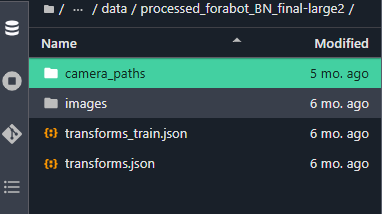
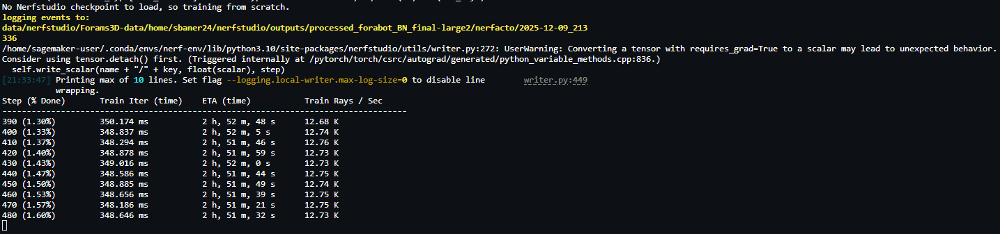
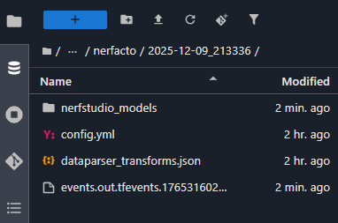
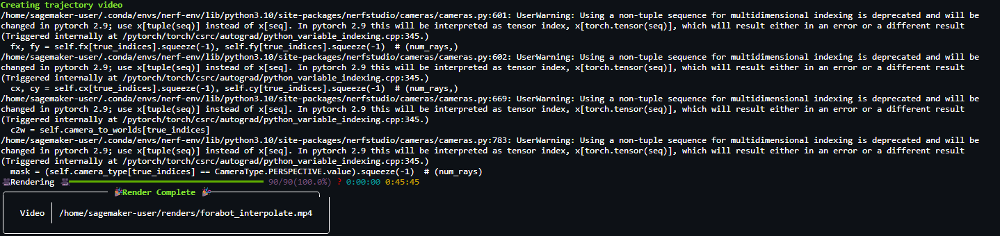
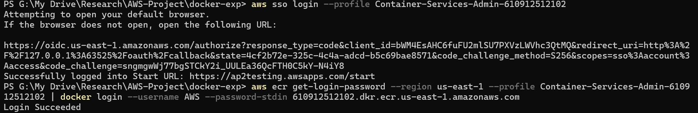
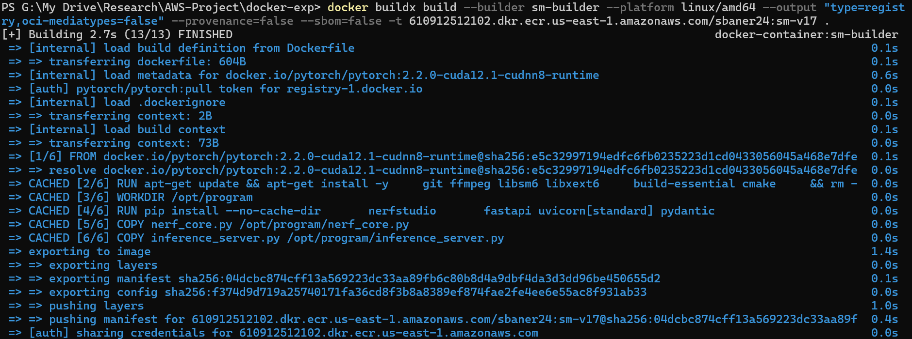
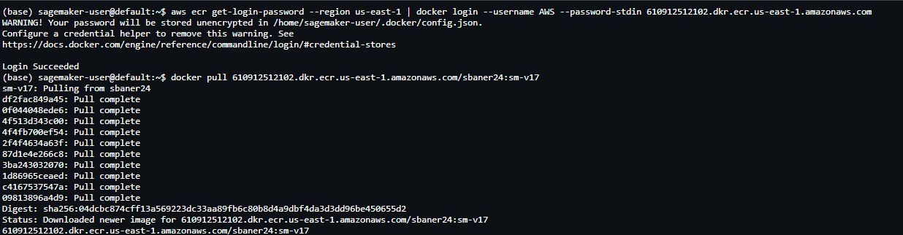

# Sagemaker-NeRF
This repository is dedicated to testing various AWS services for training and deploying Neural Radiance Field (NeRF) models. The experiments focus on a synthetic dataset of rendered foraminifera images, created using Blender. The dataset includes multi-view images, corresponding camera paths, and a transforms.json file required for NeRF training. You can access the dataset here: [insert link].

## Requirements

To run the training and deployment workflows in this repository, ensure the following prerequisites are met:

- AWS SageMaker Unified Studio with GPU-enabled compute resources.

- Amazon ECR (Elastic Container Registry) access with appropriate permissions granted by your AWS administrator.

- Docker for Windows (or equivalent) installed locally if you plan to build and push custom containers from your machine into ECR.

- An AWS IAM configuration that supports pushing/pulling images and creating SageMaker endpoints.

## Training a NeRF Model on SageMaker

To train a NeRF model using AWS SageMaker, begin by creating a SageMaker Unified Studio compute space with GPU access. Your workspace should allow you to launch a JupyterLab console, as shown in the figure.

All training and video-rendering steps can be performed directly from the SageMaker terminal.

1. Upload the Dataset
 
Upload your multi-view dataset (rendered images + transforms.json) to your SageMaker environment and extract it into your home directory, for example:

/home/sagemaker-user/nerfstudio/data/processed_forabot_BN_final-large2/

Ensure that the directory structure matches the expected Nerfstudio layout.

2. Set Up the Training Environment

Create a new Conda environment and install Nerfstudio along with its dependencies.
Follow the environment setup instructions here: https://docs.nerf.studio/quickstart/installation.html

Once your environment is configured, start training using:

Example Nerfstudio training command

ns-train nerfacto --data data/nerfstudio/Forams3D-data/home/sbaner24/nerfstudio/data/processed_forabot_BN_final-large2/ --output-dir data/nerfstudio/Forams3D-data/home/sbaner24/nerfstudio/outputs --vis tensorboard

3. Accessing the Trained Model

After training completes, the reconstructed NeRF model and its associated configuration files will be saved in:

4. Training Time Comparison

We benchmarked training performance on two different compute environments:

| Platform        | Hardware              | Training Time |
|-----------------|-----------------------|----------------|
| Remote server   | 2× NVIDIA A100 GPUs   | ~4 hours       |
| SageMaker       | `ml.g4dn.xlarge`      | ~2 days        |

The g4dn.xlarge instance provides significantly less GPU compute compared to A100 GPUs, resulting in much longer training times.

## Rendering a Video from the Trained NeRF

Once training is complete, you can generate a rendered video using the following command:

Example Nerfstudio render command

ns-render interpolate --load-config outputs/processed_forabot_BN_final-large2/nerfacto/2025-06-11_122746/config.yml   --output-path ~/renders/forabot_interpolate.mp4 

Due to GPU limitations on the SageMaker g4dn.xlarge instance, the rendered video was lower quality and shorter in length compared to the video generated on the remote A100 server.

On the remote server, we were also able to set up SSH tunneling to access the Nerfstudio Web UI, which provides interactive visualization and fine-grained control over camera trajectories during rendering.

In this SageMaker test environment, we did not explore building a custom web interface (e.g., a Gradio app) for real-time NeRF visualization. As a result, our ability to adjust camera paths or interact with the reconstructed scene directly inside the browser was limited.

# Containerizing a Trained NeRF Model

In many workflows, NeRF models are trained outside AWS (e.g., on remote servers equipped with multi-GPU hardware). AWS can then be used solely for model deployment, inference, and interactive visualization of the reconstructed scene.

In this project, we experimented with deploying a trained NeRF model (from our synthetic foraminifera dataset) using the following steps:

1. Containerize the Model Environment

We packaged all required dependencies, libraries, and inference scripts into a Docker image.
This ensures a consistent runtime environment when deployed on SageMaker. Docker files used to build the container can be found in the folder docker-files/.

2. Log into Amazon ECR using the AWS CLI:

3. Build the Docker Image (Local Machine)

Using Docker Desktop for Windows, we built the image locally:

This single command builds as well as pushes the image to Amazon ECR.

5. Pull the Image from ECR in SageMaker

Inside the SageMaker terminal the image can be pulled from ECR and used in a deployment configuration.

6. Create a SageMaker Endpoint

The endpoint was created using:

The model.tar.gz artifact containing the trained NeRF weights and configuration, and

The custom ECR container image built earlier.

These resources allow SageMaker to host an inference server capable of rendering NeRF outputs.
